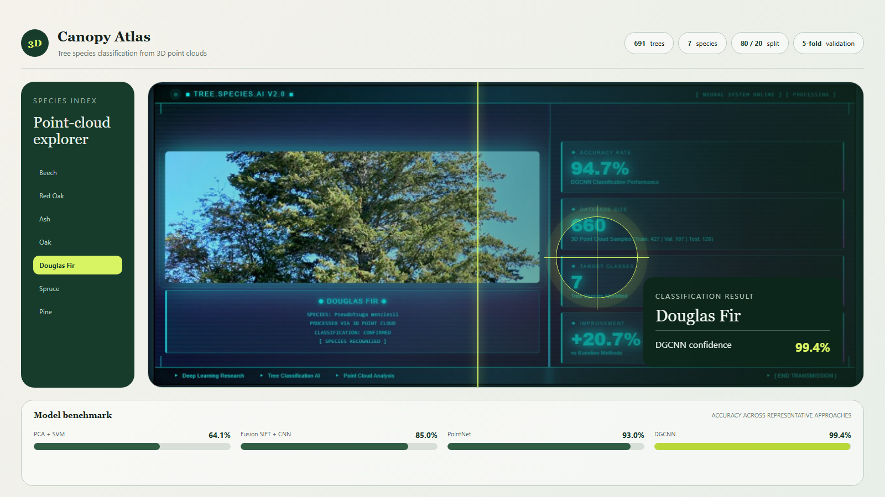

# 🌲 Classification des Espèces d’Arbres à partir de Nuages de Points 3D et Approches Multi-vues

## Interface de visualisation

Cette maquette transforme les résultats expérimentaux en une interface d’exploration : sélection des espèces, visualisation de l’arbre analysé, prédiction DGCNN et comparaison directe des modèles.

## 🧩 1. Présentation du projet
Ce projet a pour objectif de **mettre en œuvre et comparer plusieurs méthodes** de **classification d’espèces d’arbres** à partir de données de **nuages de points 3D**.  
Les approches testées incluent des techniques **2D multi-vues**, **3D descriptives** et **deep learning direct** sur nuages de points.  
L’objectif final est de déterminer **la méthode la plus performante** pour cette tâche complexe.

---

## 📦 2. Acquisition et préparation des données

### 🔗 Téléchargement du dataset
Les données proviennent du dépôt suivant :  
👉 [https://data.goettingen-research-online.de/dataset.xhtml?persistentId=doi:10.25625/FOHUJM](https://data.goettingen-research-online.de/dataset.xhtml?persistentId=doi:10.25625/FOHUJM)

Chaque dossier correspond à une espèce d’arbre.  
Le dataset contient au total **691 arbres**, répartis comme suit :

| Espèce        | Nombre d'arbres |
|----------------|-----------------|
| Hêtre (Beech)        | 164 |
| Chêne rouge (Red Oak) | 100 |
| Frêne (Ash)           | 39  |
| Chêne (Oak)           | 22  |
| Sapin de Douglas      | 183 |
| Épicéa (Spruce)       | 158 |
| Pin (Pine)            | 25  |
| **Total**             | **691** |

---

## 🎨 2.1 Visualisation des données
- **2D :** Matplotlib pour l’exploration simple des projections.  
- **3D :** Open3D pour la visualisation interactive des nuages de points.  

---

## ✂️ 2.2 Division des données
- **Jeu d’entraînement :** 80 %  
- **Jeu de test :** 20 % (défini par `test.csv`)  

---

## 🧠 3. Méthodes de classification

### 🖼️ 3.1 Méthodes indirectes — Approches 2D multi-vues
- Multi-view + Descripteurs classiques + Modèles ML
- Multi-view + CNN entraîné from scratch  
- Multi-view + CNN pré-entraîné (Fine-tuning / Transfer Learning)
- Multi-view + CNN pré-entraîné + Modèles classiques (SVM)
- Multi-view + Fusion (Descripteurs + CNN)

---

### 🧩 3.2 Méthodes quasi-directes — Descripteurs 3D + SVM
- Extraction de **caractéristiques géométriques 3D**
- Classification via **SVM polynomial**

---

### 🌐 3.3 Méthodes directes — Deep Learning sur nuages de points
Ces modèles opèrent directement sur les points sans conversion en images :
- **PointNet** → [GitHub officiel](https://github.com/charlesq34/pointnet)
- **DGCNN (Dynamic Graph CNN)** → [GitHub officiel](https://github.com/WangYueFt/dgcnn)

---

## ⚙️ 4. Stratégie d’évaluation

- **Splits :** train/test fixe (80%/20%) avec stratification.  
- **Validation croisée :** 5-fold sur l’ensemble d’entraînement pour la recherche d’hyperparamètres.  
- **Métriques utilisées :**
  - Accuracy
  - Balanced Accuracy
  - F1-score (macro et weighted)
  - Matrices de confusion
- **Implémentation :**
  - PyTorch → modèles PointNet & DGCNN  
  - Scikit-learn → SVM et méthodes classiques  
  - Open3D → prétraitement 3D

---

## 📊 5. Résultats Expérimentaux

### 🖼️ 5.1 Méthodes indirectes (2D multi-vues)

| Méthode | Accuracy | Balanced Acc. | F1-score (weighted) |
|----------|-----------|---------------|---------------------|
| SIFT Bag-of-Words + SVM polynomial | 0.70 | 0.70 | 0.689 |
| CNN from scratch | 0.75 | 0.65 | 0.654 |
| ResNet50 fine-tuning | 0.77 | 0.75 | 0.77 |
| ResNet50 features + SVM | 0.83 | 0.739 | 0.829 |
| CNN pré-entraîné (Transfer Learning) | 0.79 | 0.77 | 0.76 |
| Fusion SIFT + CNN | **0.85** | **0.77** | **0.79** |

🧠 *La fusion des caractéristiques classiques et CNN offre les meilleures performances parmi les méthodes indirectes.*

---

### 🧩 5.2 Méthodes quasi-directes (3D Descripteurs + SVM)

| Méthode | Accuracy | Balanced Acc. | F1-score (weighted) |
|----------|-----------|---------------|---------------------|
| PCA Features + SVM poly | 0.641 | 0.548 | 0.638 |

⚙️ *Ces approches sont moins performantes, probablement en raison d’une perte d’information géométrique.*

---

### 🌐 5.3 Méthodes directes (PointNet & DGCNN)

| Méthode | Accuracy | Balanced Acc. | F1-score (weighted) |
|----------|-----------|---------------|---------------------|
| PointNet | 0.93 | 0.93 | 0.929 |
| **DGCNN** | **0.994** | **0.994** | **0.994** |

🏆 *Le modèle DGCNN surpasse toutes les autres approches, atteignant presque 99,4 % de précision.*

---

## 🧰 6. Outils et bibliothèques utilisées
- **Python**
- **NumPy**, **Pandas**, **Matplotlib**, **Scikit-learn**
- **Open3D** pour la manipulation des nuages de points
- **PyTorch / Torchvision** pour les modèles de deep learning
- **Jupyter Notebook**

---

## 📄 7. Rapport du projet
📘 [Télécharger le rapport complet en PDF](./VFTree_Classification_Report_ArehalBtissam_ElfaizRekaia_ErreghayHajar.pdf)

---

  

Université Abdelmalek Essaâdi — Faculté des Sciences et Techniques de Tétouan  
*Projet de Fin d’Études (Licence en Informatique, option Analytique des Données)*

---

## 🧾 8. Licence
Ce projet a été réalisé dans un cadre académique.  
Toute réutilisation doit mentionner les auteurs originaux.

---

⭐ **Si ce projet vous a été utile, n’hésitez pas à lui attribuer une étoile sur GitHub !**
